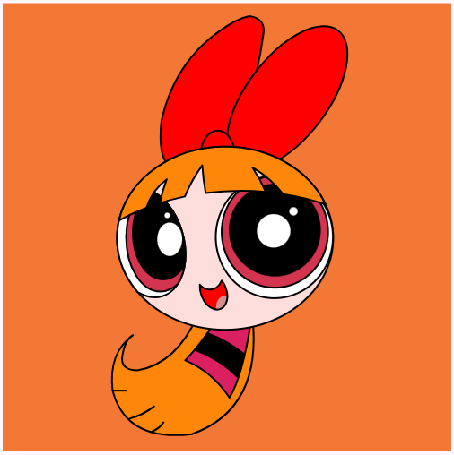

# Flutter Blossom Art

This is a Flutter project that draws the character Blossom from The Powerpuff Girls using Flutter's drawing API.

## 📌 Technologies Used
- Flutter
- Dart
- `CustomPainter` for vector rendering

## 🎨 Description
The app renders the character Blossom on the screen using vector elements drawn with `CustomPainter`. Each part of the drawing (eyes, mouth, hair, dress) is created separately and combined to form the final image.

## 📂 Project Structure
```
./ lib
  ├── main.dart          # Application entry point
  ├── home_page.dart     # Main screen containing the drawing logic
  ├── blossom_painter.dart # CustomPainter to draw Blossom
  └── utils.dart         # Helper functions and transformations
```

## 🛠️ How to Run
### 1️⃣ Clone the repository
```sh
$ git clone https://github.com/your-repo/flutter-blossom-art.git
$ cd flutter-blossom-art
```

### 2️⃣ Install dependencies
```sh
$ flutter pub get
```

### 3️⃣ Run the application
```sh
$ flutter run
```

## 📦 Dependencies
In the `pubspec.yaml` file, this project uses:
```yaml
dependencies:
  flutter:
    sdk: flutter
```

## 🚀 How It Works
### `CustomPainter` Implementation
The drawing is done using the `BlossomPainter` class, which extends `CustomPainter` and overrides the `paint` method to render the elements:
```dart
class BlossomPainter extends CustomPainter {
  @override
  void paint(Canvas canvas, Size size) {
    final paint = Paint()..color = Colors.pink;
    canvas.drawCircle(Offset(size.width / 2, size.height / 2), 50, paint);
  }

  @override
  bool shouldRepaint(covariant CustomPainter oldDelegate) => false;
}
```

### Displaying in the UI
To display the drawing on the screen, we use `CustomPaint` inside the `Scaffold` widget:
```dart
@override
Widget build(BuildContext context) {
  return Scaffold(
    body: Center(
      child: CustomPaint(
        size: Size(200, 300),
        painter: BlossomPainter(),
      ),
    ),
  );
}
```

## 🖼️ Screenshot


## 📌 Features
- Precise vector rendering with `CustomPainter`
- Uses matrix transformations for coordinate adjustments
- Responsive interface for different screen sizes

## 🔧 Future Improvements
- Animations to bring more dynamism to the drawing
- Shader implementation for more realistic effects
- Customization of colors and elements via UI

## 📄 License
This project is open-source and available under the [MIT License](LICENSE).

